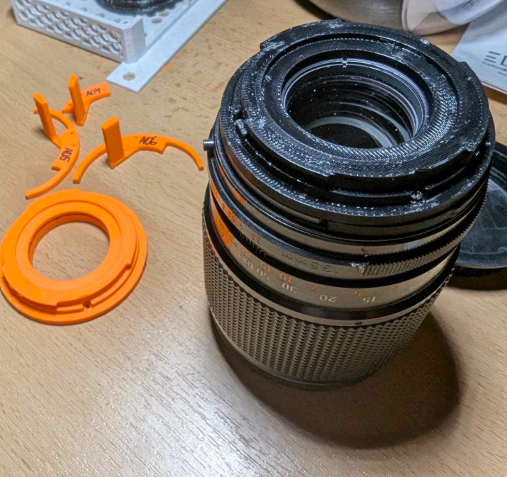

# Canon FD 135mm f/2.5 to Canon EF change of mount

This is a free time project to create an adapter that can be used to replace the FD mount to a more modern EF mount on the old Canon FD 135mm f/2.5 lens.

The final modified lens can look something like this:

To disassemble the lens, I recommend following this [mount conversion tutorial](https://www.youtube.com/watch?v=0rSV1Jd7ibM) - you need to unscrew the screws that are holding the FD mount in place.

You also **need to unscrew** the rear optical element to be able to remove the mount from the rest of the lens. Then you only have to unscrew the 2 screw holding the apreture arm in place and you can start with the installation of the new mount.

## Parts

There are two parts that need to be printed:

- [The EF mount adapter (OpenSCAD)](adapter.scad)
- [The aperture arm (FreeCAD)](aperture_arm.FCStd)

Save the screws you unscrewed from the original mount, you will need them to reattach the new mount to the lens.

## Infinity focus adjustment

After you finish the assembly, you should check if the lens can focus to infinity. If not, you can adjust the infinity position of the lens by unscrewing the three little screws on the focuser ring and by an upwards motion it should come a bit up and then get stuck. 

Then, you should see a part on the helical with three philips screws that hold a small metal plate down - by loosing them, move the plate to the side which allows the lens to screw inwards more.

If even this is not enough, you can uncrew the rear optical element and suspend it above the part that holds it in place (by jamming it into the EF mount adapter and securing it in some way).

# Other lenses

Feel free to modify the measurements in the adapter.scad to fit other lenses, the mount is designed to exactly fit the Canon FD 135mm f/2.5 lens, but it should be easily modifiable to fit other lenses.

## License
GPLv3

by [Biosias](https://github.com/biosias) and [kubakubakuba](https://github.com/kubakubakuba)